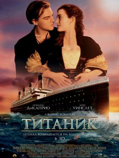

# Titanic---Machine-Learning

## Summary
---
Needs to create a model that predicts which passengers survived the Titanic shipwreck. 
On April 15, 1912, during her maiden voyage, the widely considered “unsinkable” RMS Titanic sank after colliding with an iceberg. Unfortunately, there weren’t enough lifeboats for everyone onboard, resulting in the death of 1502 out of 2224 passengers and crew.
---
## Results
 
---
Best classifier got top 20% on kaggle competition.
